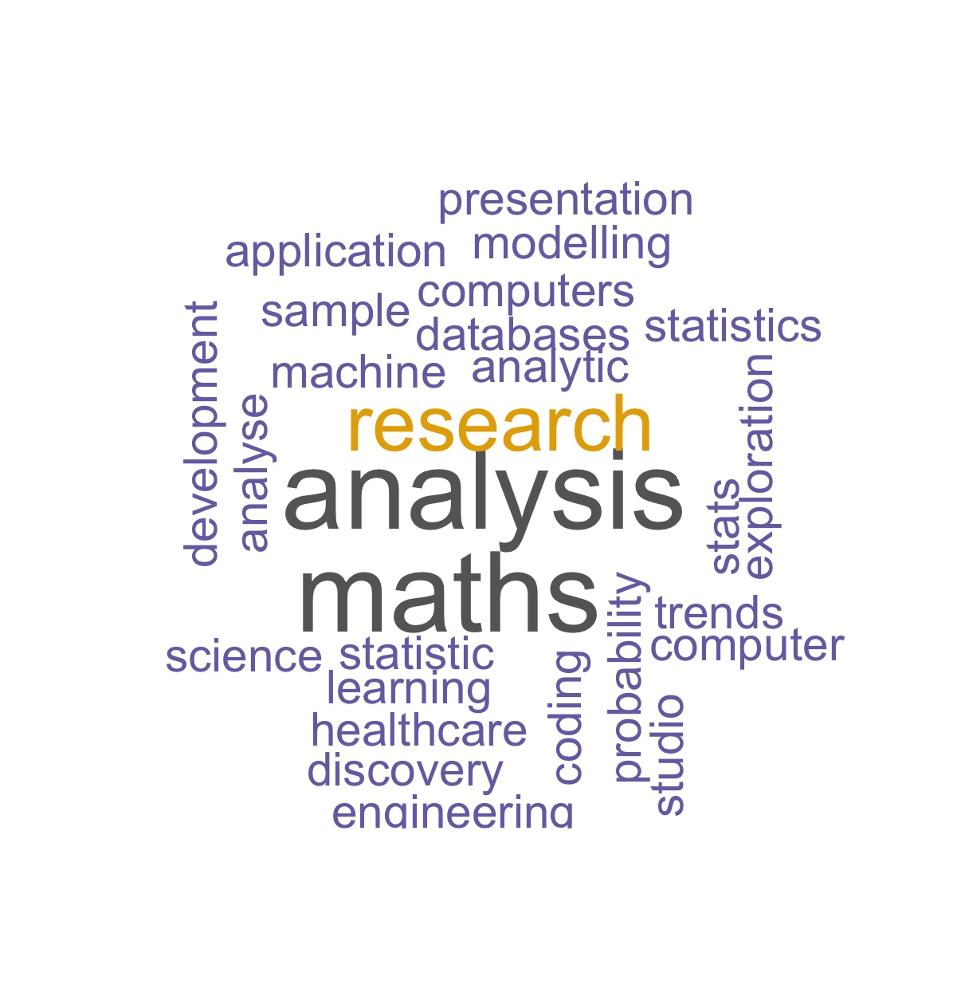
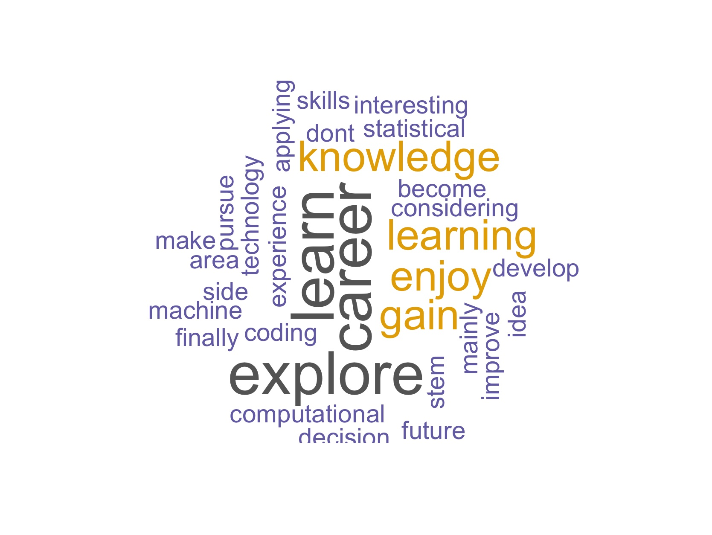

# One Data Science Programme - Week 1 materials

This folder contains the materials from our Week 1 workshop. Most of the materials are in pdf format. 

You should be able to view these files by clicking on them, and download them to your local machine.

1. [Introduction to Programming] was prepared by Katarzyna Dziopa
2. [Data Science in Industry] was presented by Stefani Muller.
3. [Where do you stand_ice breaker] was prepared by Nanaki Maitra.
4. [Introduction to learning environment R] was prepared by Asma Alfayez.
5. [Task_W1] was prepared by Asma Alfayez.  
6. [Questions for A Data Scientist] were answered by Alvina Lai, Katarzyna Dziopa, Asma Alfayez and Kai Lim. 
7. [Week1-Homework] was prepared by Millie Wagstaff.

# Word clouds generated with responses on pre-course survey:

## 1. List out 3-5 keywords that you can think of about data science.

## 2. Why do you want to join this workshop?

