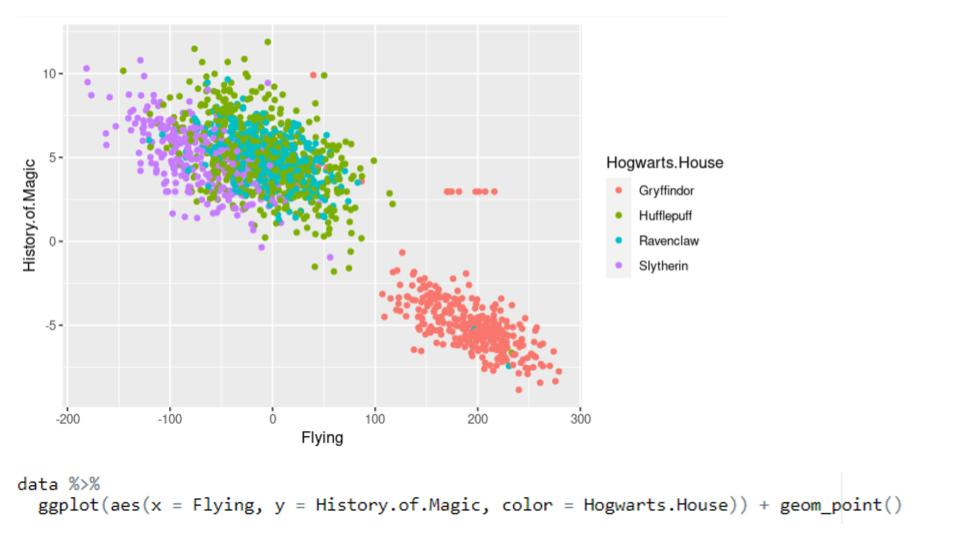
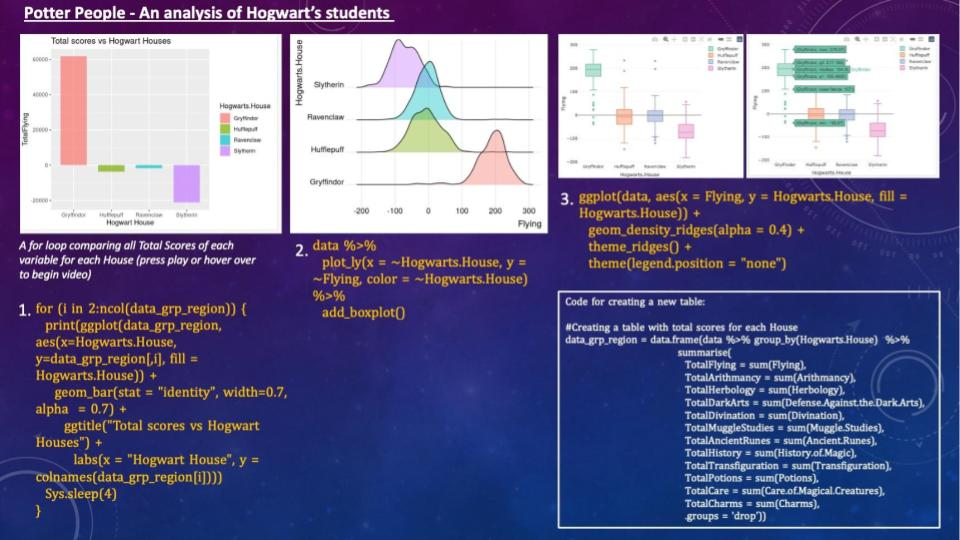
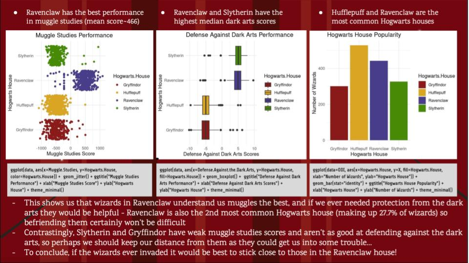
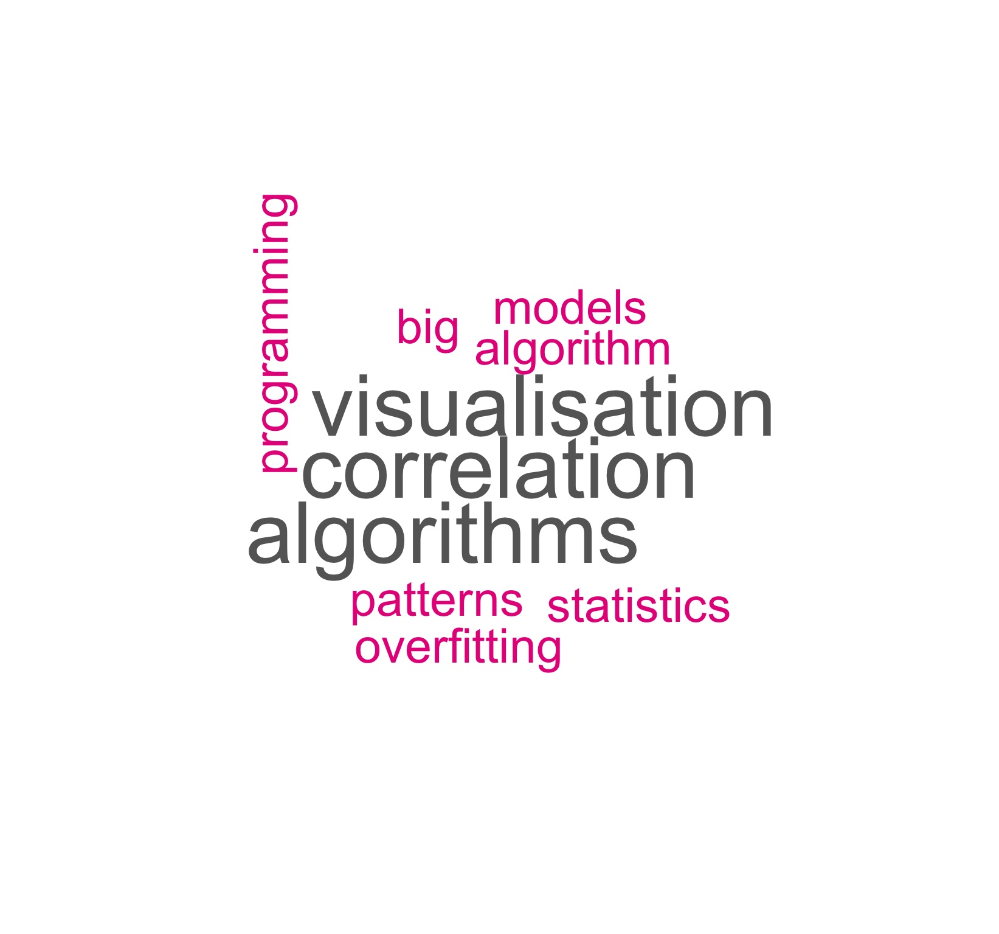

# Welcome to Week 3!

The materials for this week are: 
1. [Recap](https://github.com/zero2ds/One_Data_Science/blob/main/Week%203%20materials/Week3-RecapOfWeek2_Asma.pdf) for Week 2 prepared by Asma Alfayez.
2. [Introduction to statistical model](https://github.com/zero2ds/One_Data_Science/blob/main/Week%203%20materials/One%20Data%20Science%20Programme%20Week%203_intro_to_stats.pdf) prepared by Nanaki Maitra. 
3. [Task sheet](https://github.com/zero2ds/One_Data_Science/blob/main/Week%203%20materials/tasks.txt) prepared by Millie Wagstaff.
4. [Task solutions](https://github.com/zero2ds/One_Data_Science/blob/main/Week%203%20materials/Tasks_solutions.pdf) prepared by Millie Wagstaff.
5. [W2 homework review and competition winners announcement](https://github.com/zero2ds/One_Data_Science/blob/main/Week%203%20materials/W2%20homework%20and%20competition.pdf) by Kai Lim.

## 🏆 Competition winners 🏆

We are pleased to announce the three winners of the Week 2 competition (in alphabetical order) are: 

### Ali Elsayed

### Dylan Caddick

### Khairah Khatun

Congratulations to all of you!

## Word cloud generated from the post-course survey: List out 3-5 keywords that you can think of about data science

